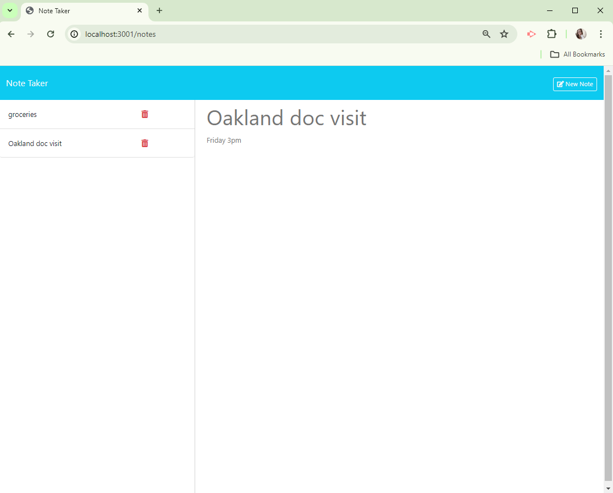

# BusyBeeNotes
A command-line application which manages a company's employee database, using Node.js, Inquirer, and MySQL.

  ## Screenshot
  

  ## Links to video
  [](https://youtu.be/Aqosu3cFaKM)


  ## Description
  A note taker application which uses an Express.js back end to save and retrieve note data from a JSON file.
  This application shows the build of the back end, while connecting it to the front end.  
  Functionality includes: entering a new note (title & text), a "clear form" option to erase the notes before saving,
  the option to save a note, as well as deleting an existing note.  Viewing previously saved notes and having them
  display is another option for the user.


  
  ## Table of Contents
  - [Installation](#installation)
  - [Usage](#usage)
  - [Licence](#license)
  - [Contributing](#contributing)
  - [Tests](#tests)
  - [Questions](#questions)
  
  ## Installation
  ``` bash
  npm i  
  node index.js
  ```
  
  ## Usage
  This application uses the Inquirer package as well as the MySQL2 package to connect to a MySQL database.
  
  ## License
    This project is licenced under the MIT license.
  [license](https://opensource.org/licenses/MIT)

  ## Contributing
  Contact Me

  ## Tests
  No test

  ## Questions
  If you have any questions I may or comments, be contacted at [GitHub](cdepalma32), or by [email](crystaldepalma@yahoo.com).